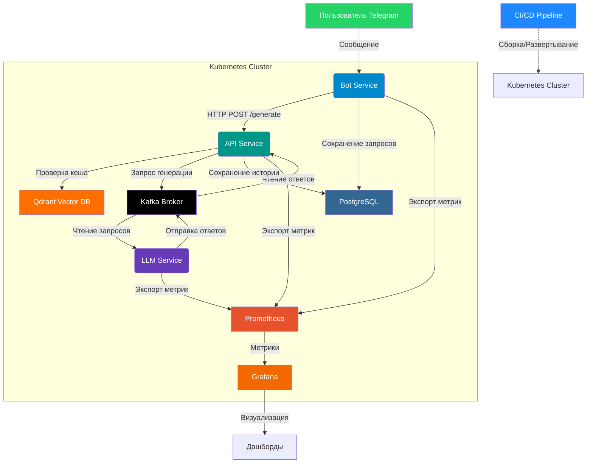

# Архитектура системы

```mermaid
graph TD
    A[Пользователь Telegram] -->|Сообщение| B(Bot Service)
    B -->|HTTP POST /generate| C(API Service)
    C -->|Проверка кеша| D[Qdrant Vector DB]
    C -->|Запрос генерации| E[Kafka Broker]
    E -->|Чтение запросов| F(LLM Service)
    F -->|Отправка ответов| E
    E -->|Чтение ответов| C
    C -->|Сохранение истории| G[PostgreSQL]
    B -->|Сохранение запросов| G
    H[Prometheus] -->|Метрики| I[Grafana]
    I -->|Визуализация| J[Дашборды]
    C -->|Экспорт метрик| H
    B -->|Экспорт метрик| H
    F -->|Экспорт метрик| H
    K[CI/CD Pipeline] -.->|Сборка/Развертывание| L[Kubernetes Cluster]
    
    subgraph Kubernetes Cluster
        B
        C
        D
        E
        F
        G
        H
        I
    end
    
    style A fill:#25d366,color:white
    style B fill:#0088cc,color:white
    style C fill:#009688,color:white
    style D fill:#ff6f00,color:white
    style E fill:#000000,color:white
    style F fill:#673ab7,color:white
    style G fill:#336791,color:white
    style H fill:#e6522c,color:white
    style I fill:#f46800,color:white
    style K fill:#2088ff,color:white
```
